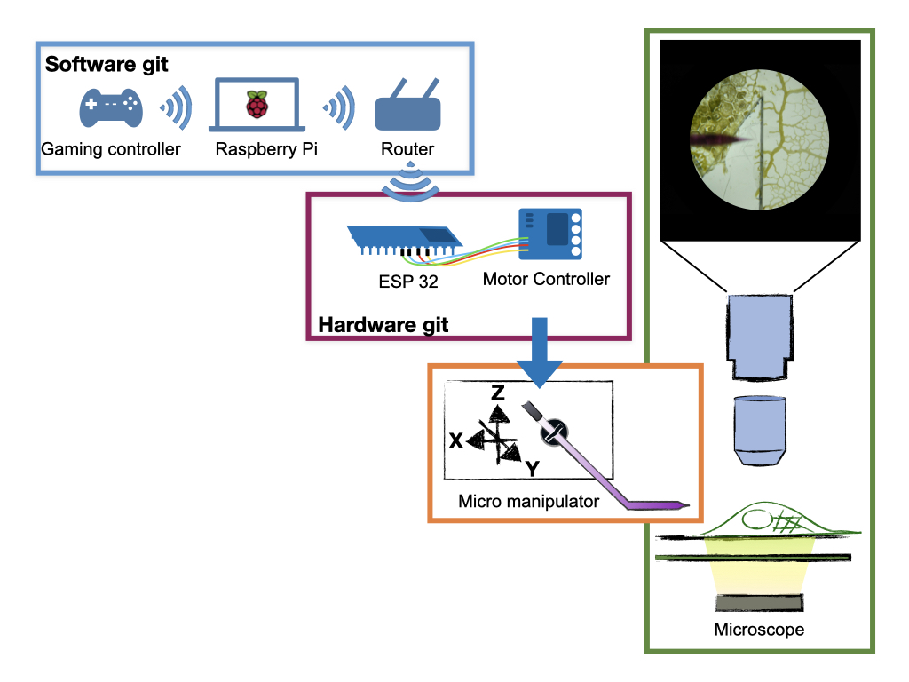

# openCM2 hardware

###Before you start:

This is the **hardware-controlling** part of the openCM2-project, the **software** part can be found **[here](https://github.com/bjks/openCM2_software)**.



Our project aims to control an [open flexure block stage](https://openflexure.org/projects/blockstage/) in combination with [UC2 microscopes](https://github.com/openUC2/UC2-GIT) via bluetooth gaming controller.


This hardware part contains Arduino scripts to be flashed on the ESP32 microcontrollers in order to interpret signals from the MQTTserver. 
Please download/clone this part to the computer to flash the scripts via an Arduino IDE to the ESP32 wifi controllers which are connected to the motors. This enables the ESP32 to interpret signals which are sent via the gaming controller to the raspberry and distributed via wifi with an MQTTserver. 

## 1. The stepper motors

### 1.1 Connect a stepper motor to the ESP32 
We use the 28BYJ-48 Stepper Motor in conjunction with the ULN2003 driver. Start by connecting these two components. Now, the driver of the stepper motor is connected to the ESP32 (NodeMCU) via the pins: 
- `IN1`: 25
- `IN2`: 26
- `IN3`: 27
- `IN4`: 14

Then the `+` pin needs to be connected to the `5V` pin on the ESP32 and the `-` pin to a `GND` pin on the ESP32.</br>
**Attention: Do not use the `GND` next to the `5V` pin, rather use `GND` between `G19` and `G21`!**

### 1.2 Setting up your ESP32
The ESP32 will run the script provided here to control the stepper motors connected to it. Firstly, you need to flash the script onto you ESP32. The instruction here are for the use of the Ardunio IDE, you are of course welcome to use something else.

#### 1.2.1 Setting up your Ardunio IDE
- Download and install the IDE as described [here](https://www.arduino.cc/en/software)
- To setup your IDE, we recommend to follow [this guide](https://randomnerdtutorials.com/installing-the-esp32-board-in-arduino-ide-windows-instructions/)
- Now we need to install the needed libraries, for that you go to `Tool -> Manage Libraries...` and install the following libraries:
  - PubSubClient
  - AccelStepper

Now you need to set/check the _Board_ and the _Port_ under `Tools`. The _Board_ should be `ESP32 dev Module` and the port should correspond to the usb port you use to connect the ESP32. If you do not know which one to choose, you can unplug the ESP32 and re-connect it to see what changes.

#### 1.2.2 Prepare the script
In order to communicate to the Raspberry Pi, you need to provide some information to the ESP32. The Raspberry Pi needs to be in the same Wifi as you will give the ESP32. You will also need the ip adress of your Raspberry Pi, that you can find by running `ifconfig wlan0 | grep -w inet`.
After you cloned this repository and open [the script](https://github.com/bjks/openCM2_hardware/tree/main/esp32/ESP32_openCM2). The lines you will need to modify look like this:
```
const char *ssid = "_____________";
const char *password = "_____________";

const char *MQTT_SERVER = "_____________";
```
Where you see the placeholder `_____________` you need to write
1.  the name of your Wifi (ssid)
- the password of your Wifi (password)
- and the ip adress of your Raspberry Pi (MQTT_SERVER) 

#### 1.2.3 Flash your ESP32
You can now flash the script onto your ESP32. 
- When your ESP32 is connected to you computer, press the `Upload` button in your IDE (top left). 
- When the console in the bottom is showing that it tries to connect press and hold the `BOOT` of your ESP32. 
- To monitor what is happening on your ESP32, use the `Serial Monitor` (`Tools -> Serial Monitor`) and set the _BAUD-rate_ to 115200.

When the Serial Monitor shows that the ESP32 is connected to the MQTT server, the motor(s) connected to the ESP32 can be controlled by the Raspberry Pi and thus the PS controller! (See the Readme in our software git [here](https://github.com/bjks/openCM2_software/blob/master/README.md) for more information)

### 1.3 Add another stepper motor
In the current setup each motor is powered by its own ESP32. To add a second and a third motor, the new ESP32s need to be flahed as before with one __important distinction__: 
The lines
```
std::string COMPONENT = "OCM2X";
//std::string COMPONENT = "OCM2Y";
//std::string COMPONENT = "OCM2Z";

```
needs to be changed to tell the ESP32 to which signal it should listen. That means the `x` motor gets the component name `OCM2X`, while the `y` motor gets the name `OCM2Y` and the `z` motor gets `OCM2Z`. Thus, you need to choose the lines (by commenting them) such that the correspnding `COMPONENT` name is left.
